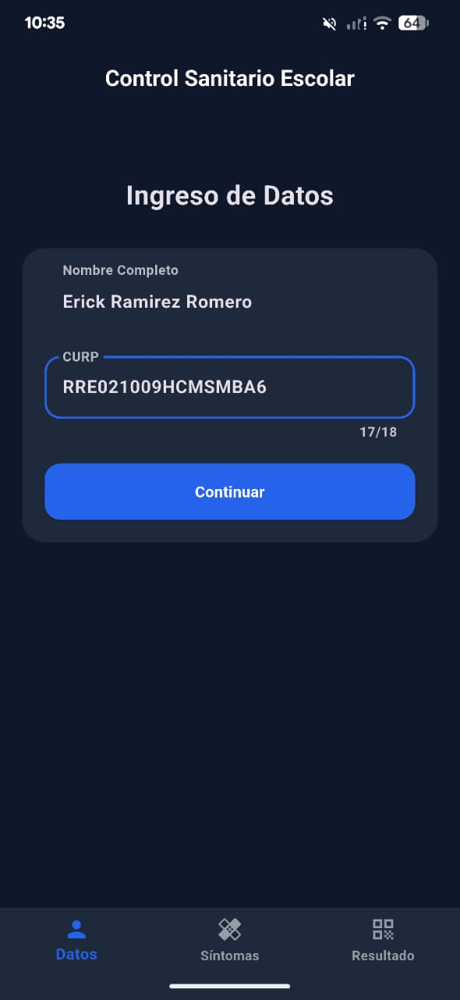
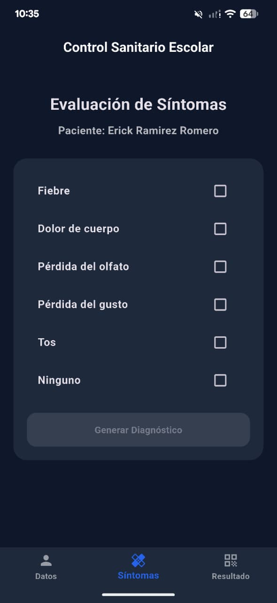
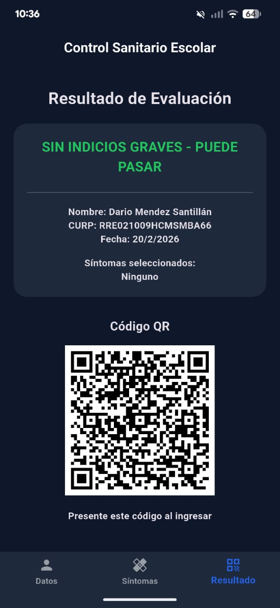
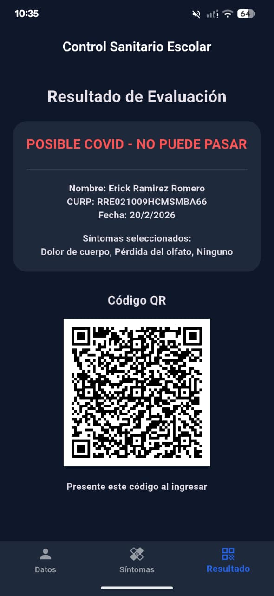

# Control Sanitario Escolar - TestCovid

Esta aplicación permite llevar un control de acceso basado en la evaluación de síntomas.

## Capturas de Pantalla

| Inicio | Síntomas | Resultado Permitido | Resultado Denegado |
|:---:|:---:|:---:|:---:|
|  |  |  |  |